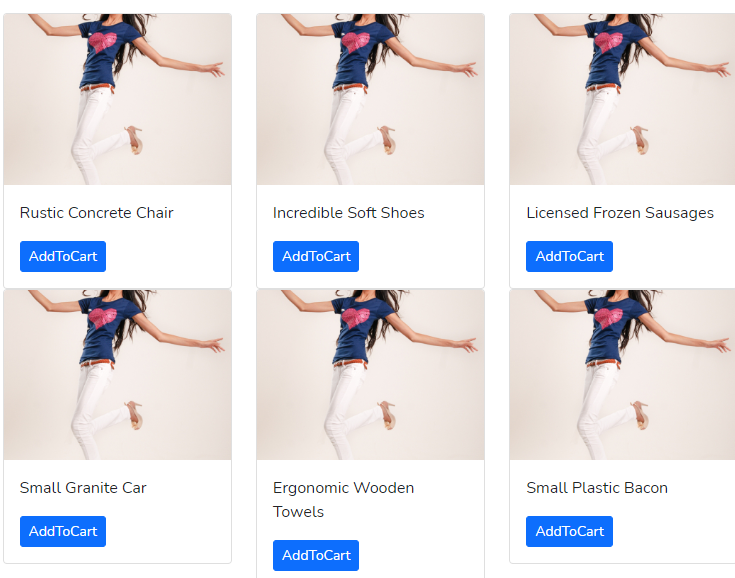
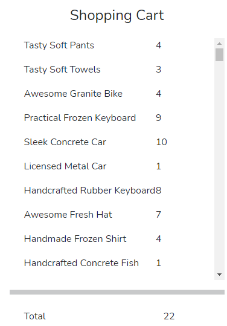

# RockBand

Features Enabled:

- Modularize App Structure
- Typescript Enabled
- NgRx Store Implementation
- Ng-bootstrap Enabled
- Advance Angular features implementation (@Inject, Token etc)
- Git Actions for CI/CD Pipelines
- Code Coverage Enabled for Each Angular Modules
- Application Theme Structured
- Storybook Enabled

### Product Module Layout

### Shopping Cart Module Layout

Project Script Guide:

- Setup Application
  - `yarn install`
- Run Development Environment
  - `yarn rock:dev`
- Run Storybook
  - `yarn rock:storybook`
- Run Tests
  - `yarn rock:test`
  - `yarn rock:cart:test`
  - `yarn rock:product:test`
- View Code Coverage of the Application
  - `yarn rock:cc`
  - `yarn rock:cart:cc`
  - `yarn rock:product:cc`
- Run Lint and Prettier
  - `yarn rock:lint`
  - `yarn rock:format`

This project was generated using [Nx](https://nx.dev).
