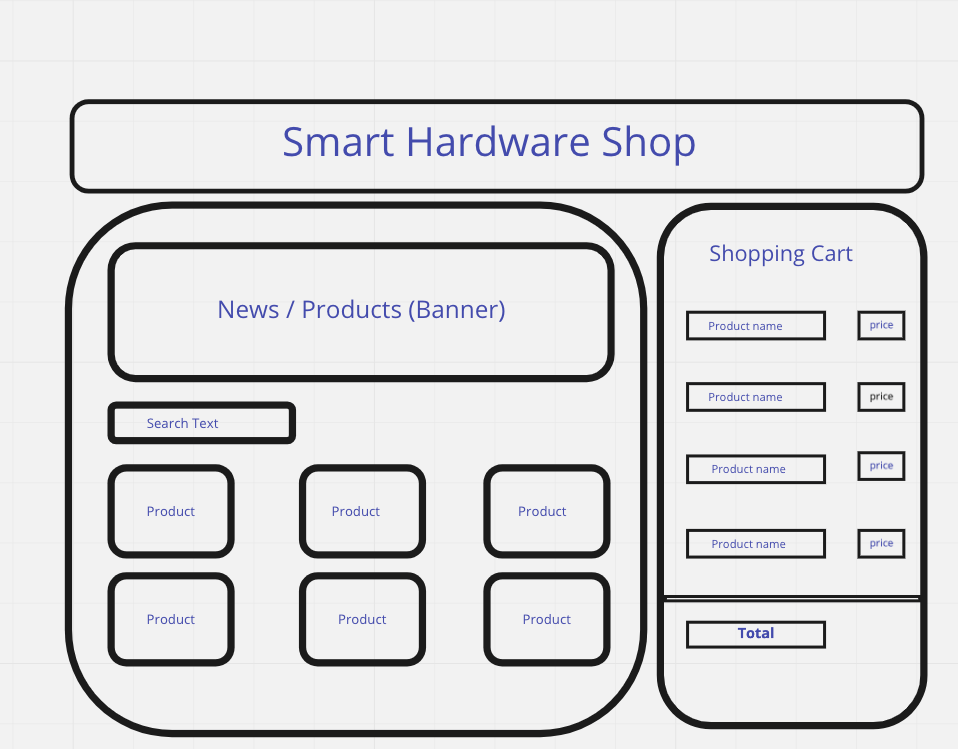

# Starter pack for assessment

The hardware store Hardvare realises that online shopping has gotten popular and wish to offer their products through an online shop. They wish that their customer should be able to see which products they can offer, and filter the products based on a search string. On the frontpage they wish to show product news. When a customer has found what he/she is looking for, the customer should have the possibility to put that in a shopping cart.
The employees at Hardvare would like the opportunity to administrate the online shop, and would therefor like an administration page where they can register or remove products as the selection changes.

**For this task we would like you to pick one or more aspects from the description of Hardvare,
and implement it in your preferred language (JS, TS etc.). You can also use frameworks if you would like that.
We would like you to limit the time spent on this task to 1-2 hours. Use the text as inspiration and make
something big or small where you focus on what you think is the most fun.**

This is basic starter kit. It consists of an API which will provide you some data for the frontend creation.
You can fork this repository to create a working solution with front-end of your choice (Angular, React, JS, Typescript).
It's totally your choice how you want to achieve the goal.

## Inspiration
We would like your to make something like the wireframe below. However, it's just for inspiration, so if you
have another vision of doing it, then do that instead!


## How to spin it up?
1. Use Yarn or NPM whichever suits you
2. Install the dependencies using ` yarn` or `npm install`
3. Run the API server using `yarn dev` or `npm run dev`

## API
We've provided a json-server which serves you an API you can use. It's optional to use, and you
of course provide your own API if you would like to.

 *  `GET`, `POST` `http://localhost:8080/api/products`

 * `PUT` `http://localhost:8080/api/products/:id` 
    - Example:
        ``` json
          {
            "name": "Hammer",
            "description": " This is a very nice Hammer",
            "price": 200
          }
        ```

* `DELETE` `http://localhost:8080/api/products/:id`
    - Example:
        ```json
          {
            "name": "Hammer",
            "description": " This is a very nice Hammer",
            "price": 200
          } 
        ```
* `GET`, `POST` `http://localhost:8080/api/users`
    - Example:
      ```json
        {
          "name": "Test User 1",
          "access": "W",
          "orders": [
            {
              "id": 1,
              "products": [
                {
                  "id": 1,
                  "quantity": 20,
                  "totalPrice": 122,
                  "discount": 20
                },
                {
                  "id": 2,
                  "quantity": 12,
                  "totalPrice": 178,
                  "discount": 0
                }
              ]
            }
          ]
        }
      ``` 

* `PUT` `http://localhost:8080/api/users/:id` 
    - Example:
      ```json 
        {
          "name": "Test User 1",
          "access": "W",
          "orders": [
            {
              "id": 1,
              "products": [
                {
                  "id": 1,
                  "quantity": 20,
                  "totalPrice": 122,
                  "discount": 20
                },
                {
                  "id": 2,
                  "quantity": 12,
                  "totalPrice": 178,
                  "discount": 0
                }
              ]
            }
          ]
        }
      ```

* `DELETE` `http://localhost:8080/api/users/:id`

Good luck!
